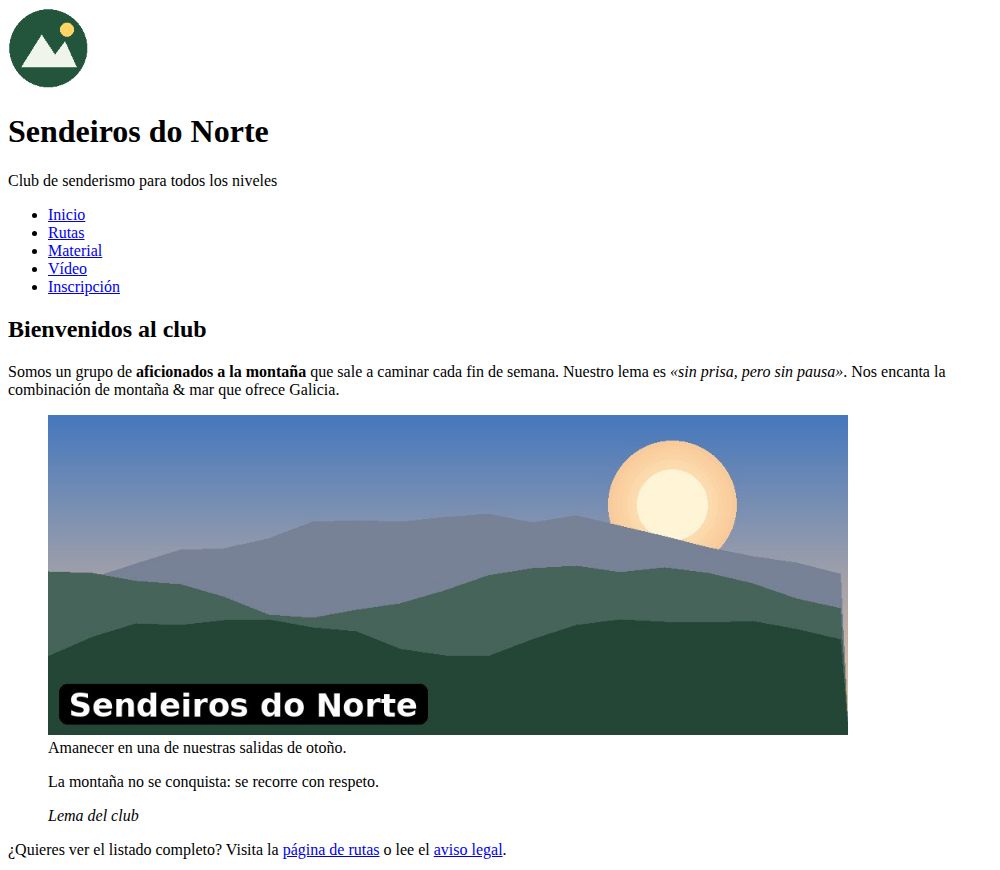
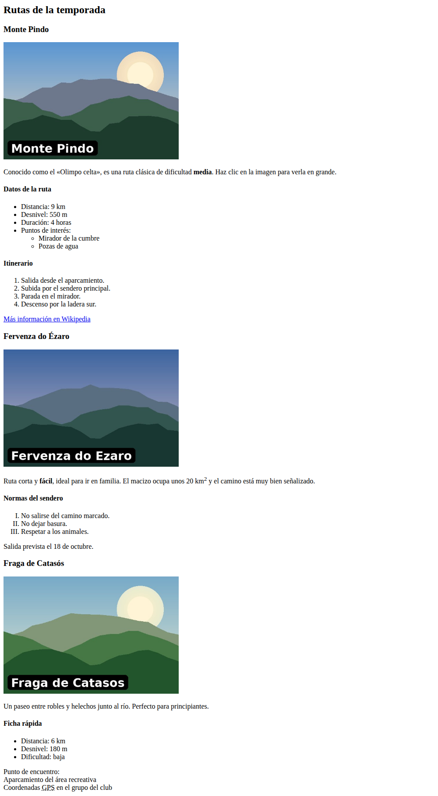
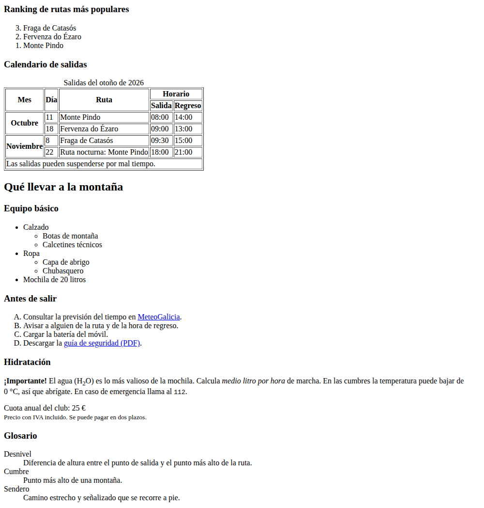
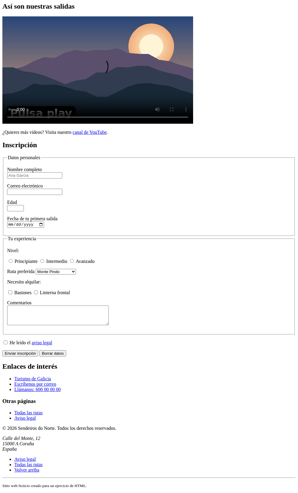

# 🥾 Ejercicio de recopilación de HTML: «Sendeiros do Norte»

Tienes delante la web de un club de senderismo hecha **solo con HTML**.
El problema: está **llena de errores** y, además, **no se ve como debería**.

## 🎯 Tu misión

1. **Corregir todos los errores** de código que encuentres en `index.html`.
2. **Dejar la página exactamente como en las capturas** de más abajo.
3. **Entregar tu trabajo con un Pull Request** (te explicamos cómo al final).

> 💡 Hay errores de dos tipos: los que **rompen** la página (etiquetas sin cerrar, enlaces rotos, imágenes
> que no cargan...) y los que hacen que **no se vea igual** que la captura (una lista que no es una lista,
> una tabla sin bordes...). Y ojo: algunos errores **tapan a otros**. Cuando arregles uno, pueden aparecer más.

## 🚫 Reglas

- **Solo HTML. Nada de CSS.** No se permite `<style>`, ni `style="..."`, ni `<link rel="stylesheet">`.
- **Nada de etiquetas obsoletas o de formato**: `<center>`, `<font>`, `<b>`, `<i>`, `<u>`... Usa la etiqueta con el significado correcto.
- **Solo puedes modificar `index.html`.** No cambies nombres de archivos ni de carpetas, ni toques otros archivos.
- **Los textos ya están escritos.** No tienes que inventar contenido; tienes que arreglar y marcar bien lo que hay.
- Si una imagen o un enlace no funciona, el fallo está en el **HTML**, no en los archivos.

## 🖼️ Resultado esperado

Así tiene que verse tu `index.html` abierto en el navegador
(captura en 4 partes; [aquí tienes la captura completa](docs/resultado-completo.png)):

**1. Cabecera y presentación**



**2. Rutas**



**3. Ranking, calendario y material**



**4. Vídeo, formulario y pie de página**



## 📁 Estructura del proyecto

```
ejercicio-html-senderismo/
├── index.html              ← ¡El único archivo que debes editar!
├── rutas.html
├── aviso-legal.html
├── imagenes/
│   ├── logo.png
│   ├── portada.jpg
│   ├── pindo.jpg
│   ├── ezaro.jpg
│   ├── catasos.jpg
│   ├── cumbre-grande.jpg
│   └── poster.jpg
├── video/
│   └── presentacion.mp4
├── documentos/
│   └── guia-seguridad.pdf
├── docs/                   ← Capturas del resultado esperado
└── .github/                ← Comprobación automática (no lo toques)
```

## 🧰 Pistas

Si no recuerdas cómo se hace algo, aquí tienes una chuleta. Busca en la
[documentación de HTML de MDN](https://developer.mozilla.org/es/docs/Web/HTML) para ver ejemplos.

| Quiero... | Pista |
|-----------|-------|
| Imagen con pie de foto | `<figure>` y `<figcaption>` |
| Una cita | `<blockquote>` y `<cite>` |
| Lista que cuenta hacia atrás (3, 2, 1) | atributo `reversed` en `<ol>` |
| Numerar con letras (A, B, C) o con romanos (I, II, III) | atributo `type` en `<ol>` |
| Lista de términos y definiciones | `<dl>`, `<dt>`, `<dd>` |
| Celdas que ocupan varias columnas o filas | `colspan` y `rowspan` |
| Que la tabla tenga borde sin usar CSS | atributo `border` en `<table>` |
| Título, cuerpo y pie dentro de una tabla | `<caption>`, `<thead>`, `<tbody>`, `<tfoot>` |
| Subíndice y superíndice | `<sub>` y `<sup>` |
| Símbolos especiales (`&`, `©`, `€`, espacio que no se parte) | `&amp;` `&copy;` `&euro;` `&nbsp;` |
| Enlace que se abre en otra pestaña (de forma segura) | `target="_blank"` **y** `rel="noopener"` |
| Enlace que descarga un archivo | atributo `download` |
| Enlace a un correo / a un teléfono | `mailto:` / `tel:` |
| Enlace a otra parte de la misma página | `href="#id"` (el `id` tiene que existir y coincidir) |
| Vídeo | `<video>` con `controls`, `poster` y dentro `<source>` |
| Asociar un texto a su campo del formulario | `<label for="...">` + `id="..."` en el campo |
| Agrupar campos de un formulario | `<fieldset>` y `<legend>` |
| Que solo se pueda elegir una opción | botones `radio` con el **mismo** `name` |